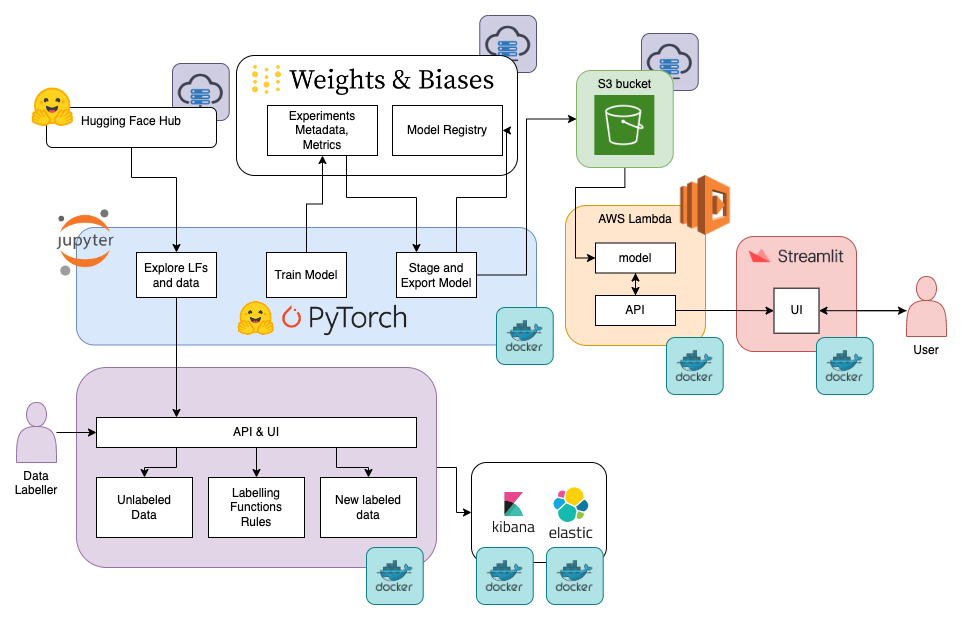

# FSDL Course 2022 - Weak Supervision and Deep Learning with text data

[](https://results.pre-commit.ci/latest/github/EdAbati/fsdl-2022-weak-supervision-project/main)

[Full Stack Deep Learning Course 2022](https://fullstackdeeplearning.com/course/2022/) project

Team 44:

- Aleks Hiidenhovi: [alekshiidenhovi](https://github.com/alekshiidenhovi)
- Bernardo García: [bergr7](https://github.com/bergr7)
- Edoardo Abati: [EdAbati](https://github.com/EdAbati)
- Diego Quintana: [diegoquintanav](https://github.com/diegoquintanav)
- Juan Manuel: [jmpc11](https://github.com/jmpc11)
- Kushal Atul Ramaiya: [ramaiyaKushal](https://github.com/ramaiyaKushal)

## Description

### Source data

AG is a collection of more than 1 million news articles. News articles have been
gathered from more than 2000 news sources by ComeToMyHead in more than 1 year of
activity. ComeToMyHead is an academic news search engine which has been running
since July, 2004. The dataset is provided by the academic comunity for research
purposes in data mining (clustering, classification, etc), information retrieval
(ranking, search, etc), xml, data compression, data streaming, and any other
non-commercial activity. For more information, please refer to the link
http://www.di.unipi.it/~gulli/AG_corpus_of_news_articles.html .

The AG's news topic classification dataset is constructed by Xiang Zhang
(xiang.zhang@nyu.edu) from the dataset above. It is used as a text
classification benchmark in the following paper: Xiang Zhang, Junbo Zhao, Yann
LeCun. Character-level Convolutional Networks for Text Classification. Advances
in Neural Information Processing Systems 28 (NIPS 2015).

### Weakly supervised dataset with unlabeled data from AG NEWS dataset

https://huggingface.co/datasets/bergr7/weakly_supervised_ag_news

```python
from datasets import load_dataset
dataset = load_dataset("bergr7/weakly_supervised_ag_news")
```


...

## Requirements

- [Docker](https://docs.docker.com/get-docker/)
- [`conda`](https://docs.conda.io/projects/conda/en/latest/user-guide/install/index.html)
- a `.env` file in the root of this project (based on `.env.sample`)
- Optional, for AWS deployment:
  - [An AWS Account](https://portal.aws.amazon.com/gp/aws/developer/registration/index.html?nc2=h_ct&src=header_signup)
  - [AWS CLI](https://aws.amazon.com/cli/) installed and configured

### Setup project

Create a virtual environment using `conda`: `make conda-env-and-update`

## Usage

The project includes many services. They are either running as docker containers or available as public online services.



This project has the following services:

1. `jupyter`: a Jupyter notebook server with support for the NVIDIA A100-SXM4-40GB GPU (CUDA 11.6) and contains scripts for training and evaluating models
1. `lambda`: a lambda function for serving predictions
1. `streamlit`: a Streamlit application for displaying a user interface
1. `rubrix`: a Rubrix server for annotating data
1. `elastic`: an Elasticsearch server for storing data from Rubrix
1. `kibana`: a Kibana server for visualizing data from Elasticsearch

### Rubrix

Launch locally the `rubrix` service (you also need the `elasticsearch` and `kibana` service):

```bash
docker compose -f docker-compose.yml up -d rubrix elasticsearch kibana
```

Afterward, you should be able to access the web app at http://localhost:6900/.

The default username and password are `rubrix` and `1234`.


### Register model in W&B and convert to TorchScript

1. Add a registered model in the W&B model registry (guide [here](https://docs.wandb.ai/guides/models#model-registry-quickstart))
2. Run the command using the name in the registry as 'model_name':

   ```bash
   python cli/deploy.py register-and-convert-model --artifact-name="[entity]/[project]/[artifact_name]:[alias]" --model-name="[entity]/[project]/[model_name]"
   ```

This will register the model artifact in the registry and it will convert it into the TorchScript format.

## Use docker-compose

All the services can be launched using `docker-compose`, and its configuration is shared across many `yml` files that can by chained with the `-f` command. Read more about this in the [docker-compose documentation](https://docs.docker.com/compose/extends/). You will need to provide a `.env` file with variables listed in `.env.sample` for this deployment to work.

In particular, the following files are used:

- `docker-compose.yml` (`base`) is used to run the project in a container. It contains all the services a part from the proxy.
- `docker-compose.override.yml` (`override`) is used to run the project as development environment. It exposes many volumes to allow quick prototyping.
- `docker-compose.nvidia.yml` (`nvidia`) extends the `jupyter` container and adds support for GPU usage.

These can be launched using `make`, e.g. `make dev.all.up` will launch all the services combining the `base` and `override` configs. The `Makefile` contains a list of all the commands.

## Contributing

As the project is made by multiple services, please follow the guide corresponding to the service you want to contribute to.

### Entire project

If you need to work on a feature that requires all the services to be active and running (e.g. active learning loop with notebook and rubrix), you can run `make dev.all.up.build`.

### Jupyter: Main app and notebooks

1. Create a dev environment either with `conda` or with `docker`(suggested way):

    - **Docker**: Launch locally the `jupyter`service using the `dev` config for `docker-compose`. This will mount the local directory to the container and it will allow you to change the local files and see changes in the container straight away:

      ```bash
      docker compose build jupyter
      docker compose -f docker-compose.yml -f docker-compose.override.yml up -d jupyter
      ```

      (Optional) Install `pre-commit` hooks: `make install-pre-commit`

2. Update the code in the folder:

    - `services/jupyter/src/app`: contains the main code of the application (model training, deployment)
    - `services/jupyter/src/notebooks`: contains useful notebooks for data exploration, testing, ...

### AWS Lambda

Please follow the guide [here](/services/lambda/README.md#contributing-to-the-lambda-api-service)

### Streamlit UI

Please follow the guide [here](/services/streamlit/README.md#contributing-to-the-streamlit-ui-service)
