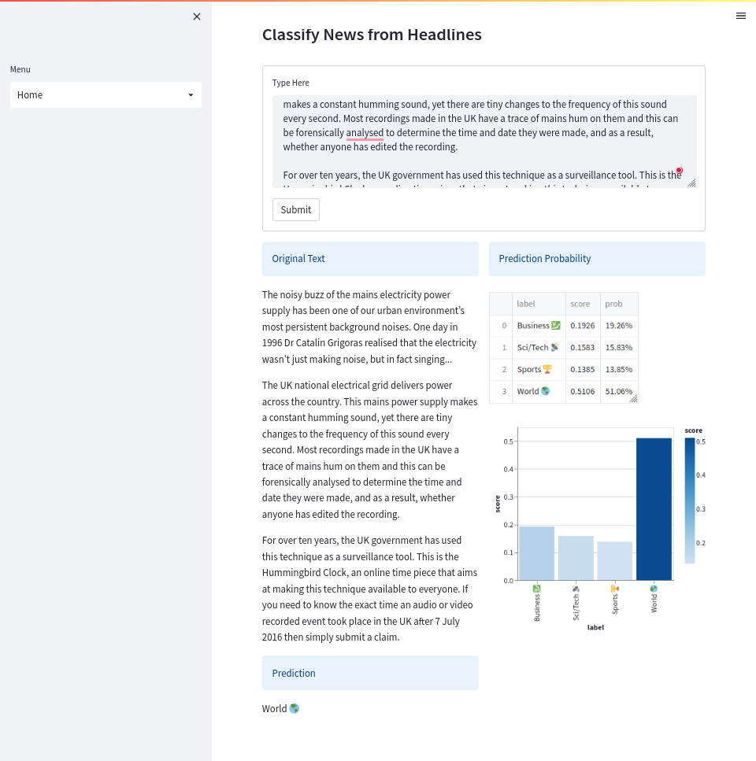

# About

A [`streamlit`](streamlit.io) interface to use a news classifier from an AWS lambda function.

It consumes an environment variable `LAMBDA_URL` that points to an API endpoint that serves predictions from a lambda function.

## Screenshot

## Getting started

1. Install docker
2. Use the docker-compose file in the root of the project to build and launch the `streamlit` service
   1. `docker compose pull streamlit && docker compose up -d streamlit`

## Contributing

0. Navigate to the root of the project
1. Install `pre-commit` hooks with `make install-pre-commit`
2. Use the docker-compose file in the root of the project to build and launch the `streamlit` service
   1. pass the `override` config to mount the local directory to the container: `docker compose -f docker-compose.yml -f docker-compose.override.yml up -d streamlit`
   2. You'll need the `lambda` service running as well: `docker compose up -d lambda`
3. Make changes to the code and commit them to a new branch
4. Once you are happy with your changes, open a pull request
